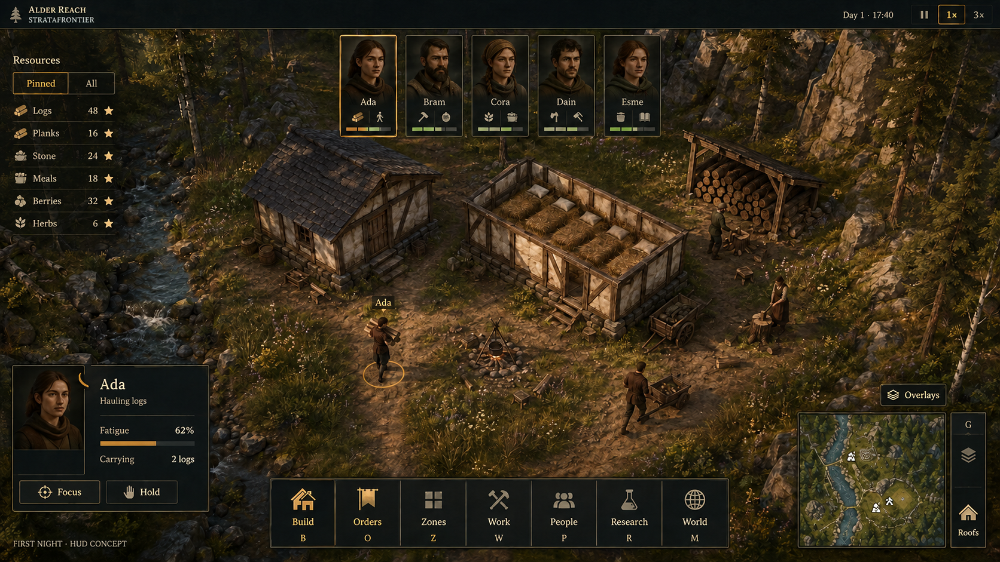
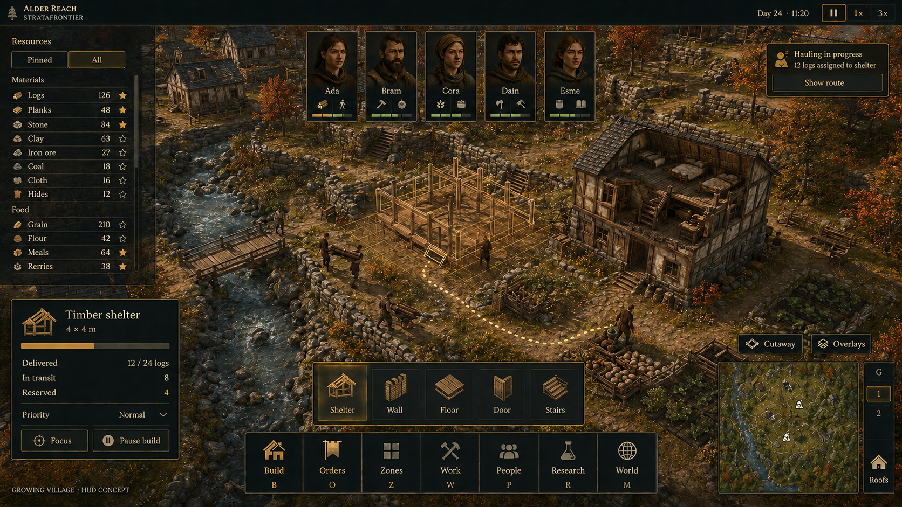
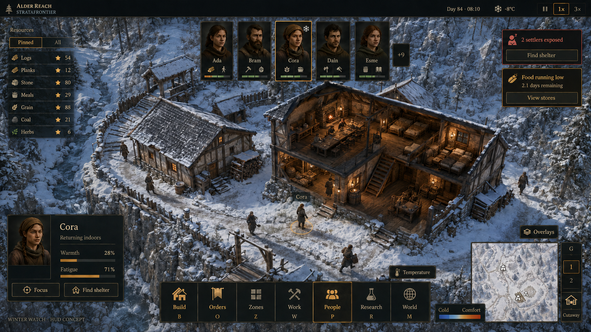
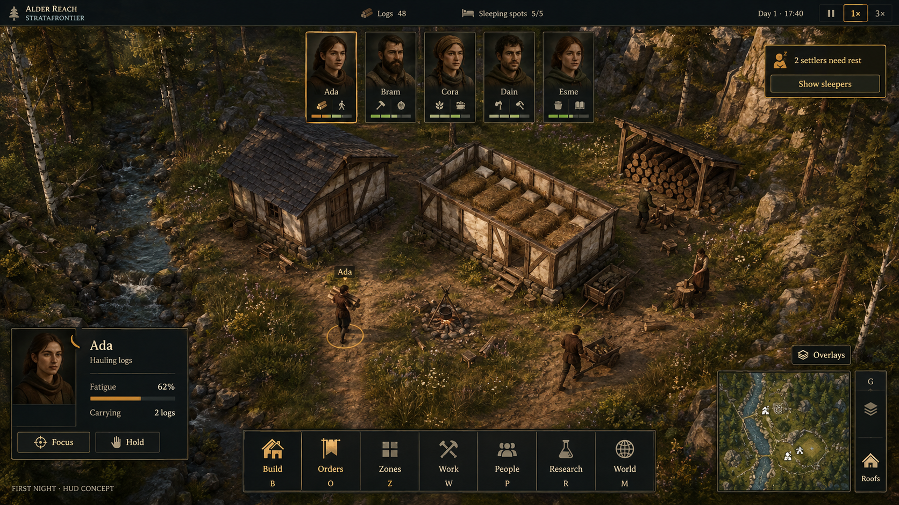
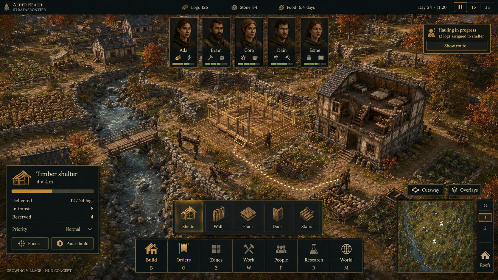
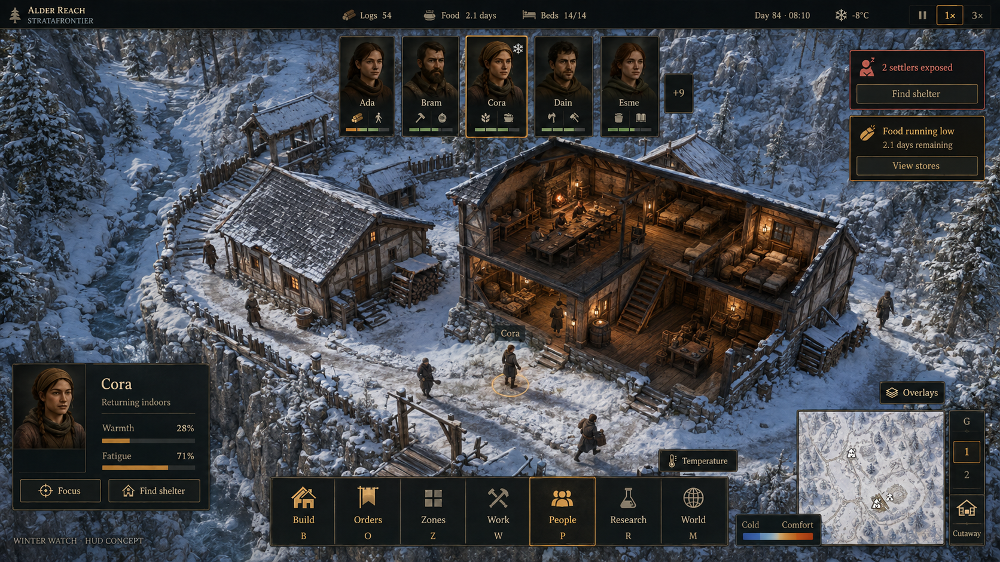

# Strata Frontier approved visual concept

September 6, 2026. The user approved the v2 HUD, pawn cards, and imagined environments as the desired visual concept. The [accepted visual direction](../visual-direction.md) records that decision, including organic natural terrain and streams. No gameplay or HUD implementation is included. The images are design references, not captures of implemented features. Findings combine inspection of current C++ source and saved Unreal gameplay captures with public reference screenshots. No user testing or live-editor validation was performed for this brief.

The straight shelters and visible local construction grid in the images are illustrative. The user's later accepted direction requires arbitrary editable spline/freehand wall curves and freeform terrain tools. Optional placement guides may remain useful; the images do not establish mandatory world-grid placement or override those accepted authoring requirements.

## Approved refinement: resource rail and quieter rest information

The user approved the overall HUD direction and pawn cards, and requested a focused refinement: move resources into a transparent vertical side list with a selected/all switch and scrolling, and remove permanent sleeping-capacity readouts. Preserve the centered pawn cards, their artwork, and the existing visual language. These are approved design preferences; the behavior and sizing below remain recommendations, not implemented or tested functionality.

Place the resource rail on the left, below the top bar and above the contextual inspector. Use **Pinned / All** to distinguish a chosen shortlist from the complete resource list in the current settlement scope. A pin control adds or removes a resource from the shortlist. Keep resource icons, readable names, and right-aligned quantities in stable rows. Group a long All list into named categories; allow category collapse where useful. Preserve pins and scroll positions when switching modes.

Keep the rail transparent with a subtle charcoal row backing for contrast over foliage, stone, and snow. A bounded list is preferable to an opaque full-height panel. Display a thin visible scrollbar when content overflows. Mouse-wheel input over the list scrolls that list without zooming the world, including at scroll boundaries; elsewhere the camera retains its normal wheel behavior. Provide keyboard focus and equivalent scrolling controls. Detailed inspection or hover explains available, reserved, and in-transit quantities and physical storage locations without expanding every row.

The top bar retains settlement identity, time, weather when supported, pause, and speed. Remove resource totals and all permanent sleeping-place or bed-capacity ratios from it. Show sleeping on the floor or outdoors in the world and in selected-pawn details where relevant. Sleeping on the floor alone should not create a routine warning. An exceptional, sustained inability to rest can produce an actionable alert with its actual cause.

This adjustment lets resource information grow without widening the top bar and keeps sleeping information tied to a person or a meaningful problem. Original v1 images remain preserved below; revised v2 images are separate sibling files.

## Refined concept gallery — v2

These are the approved primary visual references. They were edited from the v1 concepts with the built-in imagegen tool; [v2 generation instructions](PROMPTS-v2.md) accompany the originals' [generation prompts](PROMPTS.md). Resource types and quantities in **every v2 scene, including first-night**, are illustrative examples for evaluating the list. The current playable resource is logs; additional materials, food, herbs, and their displayed counts are not implemented inventory evidence. The images illustrate controls rather than working pinning, scrolling, or resource filters.

### 01 — First-night camp: Pinned resources

[Open full-size v2 image](01-first-night-v2.png). Six legible rows show icons, names, aligned counts, and filled pin stars. **Pinned** is visibly selected beside **All**. The compact rail stays well above Ada's inspector; its short list needs no overflow scrollbar. The pawn-card artwork, names, and centered arrangement remain visually consistent with v1. The top resource/sleeping-place readouts and routine tired-pawn alert have been removed.

### 02 — Growing village: All resources

[Open full-size v2 image](02-growing-village-v2.png). **All** displays twelve resource rows grouped into **Materials** and **Food**, with filled and outline stars and a thin scrollbar at the right edge. The rail stops above the construction inspector and avoids the centered pawn cards. Top-bar resource totals are removed. The scroll affordance is visible in the concept; final implementation should provide a distinct draggable thumb and track with keyboard equivalents. The original construction accounting and contextual Build palette remain readable.

### 03 — Winter watch: Pinned resources on snow

[Open full-size v2 image](03-winter-watch-v2.png). Seven resource rows remain readable over snow through restrained charcoal backing. **Pinned** is selected beside **All**; the short list fits above Cora's inspector without overflow. The top resource and bed-capacity counters are removed, while the pawn-card artwork, Cora's selection, and actionable exposure/food alerts are preserved. Winter places pin stars before quantities; the other two concepts place them after quantities. Standardize implementation columns as **icon, name, right-aligned quantity, pin** across both list modes and all scenes.

All three v2 PNGs are 1672 × 941 pixels. Visual review covered the requested list changes, text legibility, pawn-card preservation, and list/inspector separation. Source copies were verified byte-for-byte; originals remain preserved. Scrolling, pinning, and responsive behavior still require implementation and interaction review.

## Original concept gallery — v1

The concept images use the built-in imagegen tool. [Exact generation prompts](PROMPTS.md) preserve the shared direction and scene-specific instructions. Image text, icons, and shortcut assignments illustrate intent and need implementation review.

### 01 — First-night riverside camp

[Open full-size image](01-first-night.png). Current gathering, storage, shelter, sleeping-place, and fatigue mechanics inform the scene; the environment, character art, calendar display, minimap, and future management categories are imagined. The proposed interface keeps the settlement central and limits world names to the selected colonist. The approved v2 direction removes the permanent sleeping-place ratio and moves logs into the resource rail. A routine need to rest should be visible through pawn state; any exceptional rest alert should offer **Show tired colonists**, not **Show sleepers**. Reconcile shortcut hints with existing bindings before implementation.

### 02 — Growing autumn village

[Open full-size image](02-growing-village.png). The scene extends the same interface into an aspirational settlement with terraces, farming, and multiple storeys. Its construction accounting is coherent: **12 delivered + 8 in transit + 4 reserved = 24 logs**. The route and roof cutaway connect the inspector to physical work. In implementation, label the bar explicitly as material delivery, show construction work separately, and treat routine **Hauling in progress** as contextual status rather than an urgent alert.

### 03 — Winter watch

[Open full-size image](03-winter-watch.png). This aspirational scene tests the same HUD against bright snow and a warm exposed interior. Cora is consistently selected in the portrait strip, world, and inspector. The **+9** roster overflow suggests a larger colony; **2.1 days** of food agrees between the top bar and alert. Exposure and food warnings use distinct severity, words, and actions. Temperature, food, larger population, beds, and multi-storey visibility remain future systems. The approved v2 direction removes the permanent **14/14** bed ratio and moves resource readouts to the left rail. Make the temperature overlay's active state unambiguous during implementation.

The three original v1 PNGs are 1672 × 941 pixels. They were visually reviewed for project fit and readable interface content; copied files were checked against their original generated images. This review does not establish working interactions or production accessibility compliance.

## Direction

Give the settlement most of the screen while keeping named people, urgent problems, and the next action easy to find. Use a stable layout across an early camp, a growing village, and a fortified settlement. The setting remains original late-medieval low fantasy with readable stylized realism: timber, plaster, stone, slate, and natural terrain. These are locations in the game's continuous world, not separate campaign maps.

Use charcoal teal panels, ivory text, and restrained ochre/brass selection accents. Keep ornament subtle. Reserve warning color for situations requiring attention; reinforce it with an icon and explicit words. Portraits should eventually derive from the actual colonist models, as specified by the GDD.

## What needs improvement

The current native `ASFCampHUD` places the title, resources, every colonist, build controls, every shelter's controls, save/load/reset/import, and help into one permanent full-height left rail. Its large `FIRST NIGHT` heading and persistent administrative controls consume space. Text-only worker rows provide little visual distinction between identity, fatigue, cargo, and task. Every shelter contributes controls even when it is not selected. A wide top strip gives routine messages prominent placement. Nearby world labels overlap inside the shelter.

The existing teal/ivory/ochre palette is a useful starting point. The redesign primarily changes information hierarchy, placement, and contextual disclosure.

Evidence: [HUD drawing code](../../../Source/StrataFrontier/ColonyPrototype/SFCampGame.cpp), [latest camp capture](../../development/evidence/first-night/wander-cleared-720.png), and [crowded indoor capture](../../development/evidence/first-night/sleep-1080.png).

## Common layout and behavior

| Area | Contents and behavior |
| --- | --- |
| Thin top bar | Settlement/location, time, pause, and speed. Show season/weather only when those systems exist. No resource totals or sleeping/bed-capacity ratios. |
| Left resource rail | Transparent, lightly shaded rows beneath the top bar and above the contextual inspector. **Pinned / All** switch, resource pinning, icons and names, right-aligned quantities, and bounded scrolling with a visible scrollbar on overflow. Group long All lists by category. Hover or inspection reveals logistics details. |
| Centered portrait strip | Preserve the user-approved cards for Ada, Bram, Cora, Dain, and Esme, including artwork, names, selection outline, and small task/need badges. Click selects; a distinct focus action moves the camera. Full fatigue, cargo, and relevant sleeping details belong in inspection. |
| Lower-left inspector | Appears for the selected colonist, building, storage, or plan. Present identity, current state, cause of a blockage, and relevant actions. Construction shows delivered materials and work progress separately. |
| Bottom-center action dock | Labeled categories: **Build, Orders, Zones, Work, People, Research, World**. Open a contextual palette above the dock; include search and shortcut hints. Future categories appear only when functional. |
| Upper-right alerts | At most three visible urgent cards, with an expandable count/history for the rest. Each names the problem, explains the cause, and offers a relevant action or focus link. Routine confirmations are brief, quieter messages. No warning merely for sleeping on a floor; a sustained inability to rest can warrant a cause-specific alert. |
| Lower-right navigation | Minimap with nearby accessible floor, roof, and overlay controls. Clearly display active floor/cut mode. Roof hiding has a visible button as well as its keyboard binding. |

Show world names and detailed labels on selection, hover, or an alert. Use concise icons or progress markers where constant feedback is necessary. Prevent label collisions before adding more information. Keep the center clear of routine messages and decorative panels.

Put save, load, reset/new camp, historical imports, and help in a menu. Keep reset off the main HUD. Preserve familiar selection, contextual orders, pause, and keyboard shortcuts, with remapping support. No full editor-style docking system is proposed.

## Current mechanics and future concepts

| Verified playable mechanics | Planned or aspirational systems |
| --- | --- |
| Five named colonists; finite logs; limited carrying; resource reservations; outside/inside stockpiles; 4 × 4 m shelter requiring 24 logs; construction progress and suspension; doors; roof hiding; prepared sleeping spots; fatigue/rest; direct movement; hold/resume; pause and 1×/3×; save/load | Portrait production art; general zone editing; work matrices and schedules; food, thirst, mood and temperature; agriculture; production/research; water and structural support overlays; multi-storey construction and floor isolation; regional navigation/minimap |

The current prototype has fatigue rather than a full calendar or day/night lighting system. Rendered evening light, furnished interiors, developed terrain, and finished colonist art in the concepts are imagined presentation. Food, weather, temperature, research, and upper-floor readouts must not be described as current functionality.

Initial implementation should emphasize **Build, Orders, Zones, and People** as the future organization, connecting only the mechanics that already exist: shelter/sleeping-place planning, direct orders and hold/resume, current storage controls, the named roster, log accounting, fatigue, doors, and roofs. General zone painting needs its own implementation; current storage actions should remain contextual. Gate future Work, Research, World, minimap, and floor controls until usable. All Unreal implementation should remain C++ under the project policy.

The v2 resource rail initially needs only actual current resources; the present playable slice has logs. Multiple materials in the village/winter concepts illustrate future scale. Removing a permanent sleeping-capacity readout is a presentation change and does not itself change the prototype's prepared-spot rest rules. Floor/outdoor sleeping beyond those current rules remains future behavior until separately implemented.

## Three proposed images

1. **First-night riverside camp:** five colonists, a small timber shelter with its roof hidden, logs and storage, prepared sleeping places, and a selected tired worker. Demonstrate the new hierarchy using current mechanics, with imagined environmental and character art.
2. **Terraced autumn village:** construction and physical hauling across a sloping settlement; a selected building plan explains materials, work, and access. Expanded logistics, terrain, and building features are aspirational.
3. **Winter fortified village:** a snowy multi-level settlement with an exposed interior, visible floor/roof controls, and concise needs or temperature alerts. Advanced needs, weather, and vertical systems are aspirational.

Use the same palette, portrait names, dock order, selection language, and panel locations throughout. Scene variety should test the common interface rather than imply three unrelated themes.

## Sizing and accessibility proposals

Review layouts using the [development testing resolution policy](../../development/foundation.md#development-testing-resolution). Suggested starting values at 1080p are a 44–52 px top bar, 18 px body text, and 36–44 px action targets; these are design targets, not measured acceptance results. Scale text independently of world rendering. When space is constrained, collapse optional resource details and shorten the open palette before shrinking text. Alerts must not overlap portraits or the inspector.

At the concept images' 1672 × 941 size, a resource rail about 220–250 px wide can start near x=20 beneath the roughly 48 px top bar. Cap its bottom at least 16 px above the inspector. The autumn image is the tightest case: its inspector starts around y=554, so the rail should finish above approximately y=538. A compact mode header and roughly 8–12 rows fit that region while leaving the centered pawn cards and bottom dock clear. These estimates are visual layout recommendations, not interaction measurements. Prefer a shorter initial shortlist to filling all available space.

When resource rows exceed the available space, reduce the visible row count and use scrolling instead of shrinking text or letting the list overlap the inspector. Keep the rail's width stable enough for labels and aligned counts. Adapt its height to the active inspector and reserve the portrait region. The Pinned/All switch stays fixed while rows scroll; long labels may truncate with full text available on hover/focus. A subtle backing is necessary for contrast even when the overall rail feels transparent.

Provide keyboard focus, readable tooltips, text labels beside major icons, non-color selection/error cues, adjustable UI scale, reduced motion, and no flashing requirements. Validate final contrast and text fitting against both bright snow and dark interiors. Later implementation needs actual interaction and resolution testing; generated text and spacing are only visual guidance.

## Public reference research

Visual analysis was based on these three screenshots. The observations below inform our synthesis; they are not claims that Strata Frontier should copy another game's artwork or entire interface.

| Reference | Observed pattern | Application |
| --- | --- | --- |
| [RimWorld screenshot](https://www.gamersdecide.com/sites/default/files/authors/u170827/r10.jpg), from [GamersDecide](https://www.gamersdecide.com/articles/why-rimworld-is-good) | Compact portrait row and bottom management tabs | Keep people recognizable and give management categories stable locations. |
| [Oxygen Not Included screenshot](https://cdn.forums.klei.com/monthly_2023_05/20230407163836_1.jpg.92443dcff94fcd832300fb2aeefcfd01.jpg), from [Klei's forum](https://forums.kleientertainment.com/klei-bug-tracker/oni/pei-hair-issues-r40577/) | Separate construction categories, tools, and diagnostics/overlays | Separate building actions from world-analysis modes; use contextual expansion. |
| [Going Medieval screenshot](https://shared.fastly.steamstatic.com/store_item_assets/steam/apps/1029780/ss_2fded38377bcb43c1d2a7e973aa2288a9d0a040c.1920x1080.jpg?t=1739958970), from the [official Steam page](https://store.steampowered.com/app/1029780/Going_Medieval/) | Named roster and corner actions around a central 3D scene | Preserve terrain and interior readability, with explicit roof/floor access. |

Video links found for further reference: [RimWorld launch trailer](https://www.youtube.com/watch?v=3tDrxOASUog), linked by the [developer's 1.0 announcement](https://ludeon.com/blog/2018/10/rimworld-1-0-released/); [Klei's Oxygen Not Included launch trailer](https://www.youtube.com/watch?v=wcLayGm_pM4); [Going Medieval 1.0 launch trailer](https://www.youtube.com/watch?v=dX0w8TDZEsk). These videos were found and linked, not watched; no design claims above derive from video analysis.

## Local reference captures

Paths below are relative to the project root:

- `docs/development/evidence/first-night/wander-cleared-720.png` — latest clear current HUD/camp view.
- `docs/development/evidence/first-night/sleep-1080.png` — indoor label crowding and fatigue/task presentation.
- `docs/art/evidence/asset-audition/overview.png` — current shelter architecture, palette, and material reference.

Design constraints: [vision](../../gdd/00-vision-and-pillars.md), [colonists](../../gdd/03-colonists-and-society.md), [construction](../../gdd/04-construction-terrain-and-settlements.md), [physical logistics](../../gdd/05-production-research-and-economy.md), and [UI/accessibility](../../gdd/08-presentation-ui-audio-accessibility.md).
